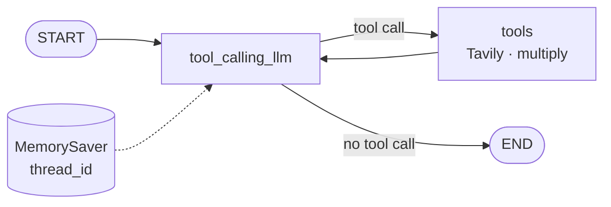
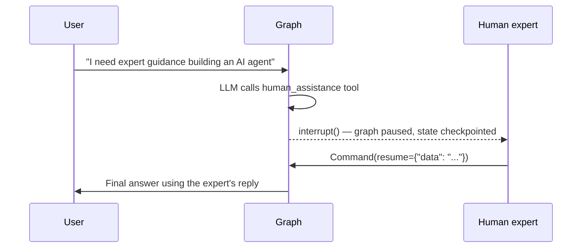
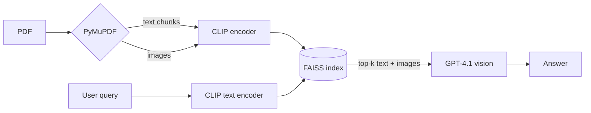
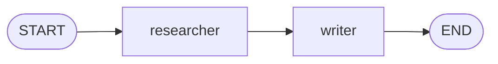
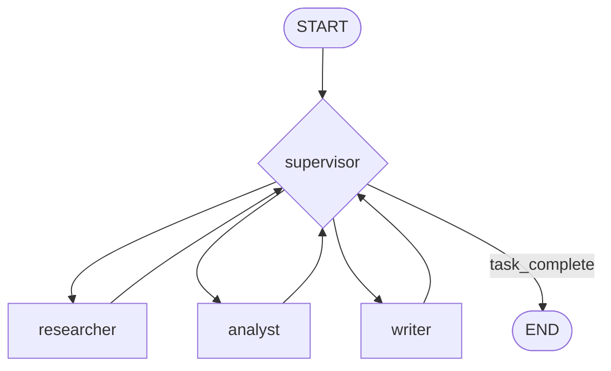

<div align="center">

# 🕸️ Agentic LangGraph

**A portfolio of stateful, tool-using AI agents built with LangGraph**


[Overview](#-overview) •
[Projects](#-projects) •
[Architecture](#-architecture-at-a-glance) •
[Setup](#%EF%B8%8F-setup) •
[Results](#-sample-results) •
[Limitations](#-known-limitations--future-work)

</div>

---

## 📌 Overview

This repository contains five independent projects that together explore how to design **agentic systems as graphs**. Each one tackles a specific problem — conversation memory, tool use, human approval, observability, multimodal retrieval and multi-agent coordination — and solves it with LangGraph's `StateGraph`.

| | |
|---|---|
| **Author** | Samarth |
| **Stack** | Python 3.13 · LangGraph · LangChain · Groq (Llama 3) · OpenAI GPT-4.1 · Tavily · LangSmith · CLIP · FAISS |
| **Format** | Jupyter notebooks + one deployable graph (`3-Debugging/agent.py`) |
| **Status** | ✅ Projects 1–4 and multi-agent (sequential + supervisor) complete · 🚧 hierarchical agents designed, not implemented |

### Objectives

- [x] Build a chatbot whose behaviour is defined by an explicit state graph
- [x] Let the LLM decide when to call external tools (web search, math)
- [x] Persist conversation memory across turns with checkpointing
- [x] Stream graph execution (`values`, `updates`, `astream_events`)
- [x] Pause a running agent for human input and resume it
- [x] Trace and debug a graph in LangGraph Studio / LangSmith
- [x] Answer questions over a PDF using both its text *and* images
- [x] Coordinate several specialised agents (sequential and supervisor patterns)
- [ ] Hierarchical teams of agents (CEO → team leads → workers)

---

## 🧭 Projects

> Click a project to expand its details.

<details open>
<summary><b>1 · Tool-Calling Chatbot with Memory</b> — <code>1-BasicChatbot/chatbot.ipynb</code></summary>

<br>

**Problem:** A plain LLM forgets everything between calls and can't look things up.

**Approach:** Built up in four stages in a single notebook:

1. **Basic chatbot** — a single `llmchatbot` node between `START` and `END`, state reduced with `add_messages`.
2. **Tool use** — the LLM is bound to `TavilySearch` (web) and a custom `multiply` function; `tools_condition` routes to a `ToolNode` whenever the model emits a tool call.
3. **ReAct loop** — the tool node feeds back into the LLM so it can chain calls (e.g. *"get recent AI news, then multiply 5 by 10"*).
4. **Memory + streaming** — compiled with a `MemorySaver` checkpointer keyed by `thread_id`, and executed with `stream_mode="updates"`, `"values"` and `astream_events(version="v2")`.



**Key concepts:** `StateGraph`, `add_messages`, `bind_tools`, `ToolNode`, `tools_condition`, `MemorySaver`, streaming modes.

</details>

<details>
<summary><b>2 · Human-in-the-Loop Assistant</b> — <code>2-HumanAssistance/humanintheloop.ipynb</code></summary>

<br>

**Problem:** Some requests should be escalated to a person instead of being answered automatically.

**Approach:** A `human_assistance` tool calls LangGraph's `interrupt()`, which suspends the graph and saves its state to the checkpointer. A human reply is then injected with `Command(resume={"data": ...})` and the graph continues from exactly where it stopped.



**Key concepts:** `interrupt`, `Command`, checkpoint-based pause/resume.

</details>

<details>
<summary><b>3 · Observable Agent (LangGraph Studio + LangSmith)</b> — <code>3-Debugging/</code></summary>

<br>

**Problem:** Agent loops are hard to debug from print statements.

**Approach:** The tool-calling graph is packaged as a module (`agent.py` → `tool_agent`) and registered in `langgraph.json`, so it can be run, inspected and replayed step-by-step in **LangGraph Studio**. LangSmith tracing is switched on through environment variables, sending every run to the `TestProject` project.

```json
{
  "dependencies": ["."],
  "graphs": { "tool_agent": "./agent.py:tool_agent" },
  "env": "../.env"
}
```

**Key concepts:** `langgraph dev`, LangSmith tracing, graph factories.

</details>

<details>
<summary><b>4 · Multimodal PDF RAG</b> — <code>4-Multimodal/1-multimodalopenai.ipynb</code></summary>

<br>

**Problem:** Standard RAG ignores charts and images inside documents.

**Approach:**

1. Parse `multimodal_sample.pdf` with **PyMuPDF**, splitting text into 500-char chunks and extracting embedded images.
2. Embed **both** text chunks and images with **CLIP (`openai/clip-vit-base-patch32`)** so they share one vector space.
3. Store precomputed embeddings in a single **FAISS** index.
4. At query time, retrieve the top-k text *and* image hits and send them together (images as base64) to **GPT-4.1**.



**Key concepts:** unified multimodal embeddings, custom FAISS index, vision-capable LLM prompts.

</details>

<details>
<summary><b>5 · Multi-Agent Systems</b> — <code>Agents/multiaiagent.ipynb</code></summary>

<br>

**Problem:** One prompt can't do research, analysis and writing equally well.

**Approach A — Sequential pipeline:** a `researcher` agent (with a Tavily `search_web` tool) hands its findings to a `writer` agent that produces a summary.



**Approach B — Supervisor:** a Groq-powered `supervisor` inspects shared state (`research_data`, `analysis`, `final_report`) and routes work to specialised agents until the task is complete.



**Approach C — Hierarchical (design only):** CEO → Research Team Lead (Data / Market researchers) and Writing Team Lead (Technical / Summary writers).

**Key concepts:** custom `MessagesState` subclasses, conditional routing functions, LLM-driven orchestration.

</details>

---

## 🏗️ Architecture at a Glance

| Project | Pattern | LLM | Tools / Data | Memory | Human-in-loop |
|---|---|---|---|:---:|:---:|
| 1 · Chatbot | ReAct loop | Groq `llama3-8b-8192` | Tavily, `multiply` | ✅ | — |
| 2 · Human assistance | Interrupt / resume | Groq `llama3-8b-8192` | Tavily, `human_assistance` | ✅ | ✅ |
| 3 · Debugging | ReAct loop (deployable) | Groq `llama3-8b-8192` | `add` | — | — |
| 4 · Multimodal RAG | Retrieve → generate | OpenAI `gpt-4.1` | CLIP + FAISS over PDF | — | — |
| 5 · Multi-agent | Sequential / Supervisor | Groq `llama-3.1-8b-instant` | Tavily | — | — |

```
Langgraph/
├── 1-BasicChatbot/        # Project 1 — chatbot, tools, memory, streaming
├── 2-HumanAssistance/     # Project 2 — interrupt + resume
├── 3-Debugging/           # Project 3 — Studio-ready graph + langgraph.json
├── 4-Multimodal/          # Project 4 — CLIP/FAISS multimodal RAG + sample PDF
├── Agents/                # Project 5 — multi-agent architectures
├── pyproject.toml         # uv project definition
├── requirements.txt
└── uv.lock
```

---

## ⚙️ Setup

<details open>
<summary><b>1. Install dependencies</b></summary>

```bash
git clone <this-repo-url>
cd Langgraph

# Recommended: uv
uv sync

# or pip
python -m venv .venv && source .venv/bin/activate
pip install -r requirements.txt
```

Projects 4 and 5 use packages that aren't in the core dependency list:

```bash
# Project 4 — multimodal RAG
uv add langchain-openai langchain-community pymupdf transformers torch faiss-cpu scikit-learn pillow

# Project 5 — multi-agent (TavilySearchResults)
uv add langchain-community
```

</details>

<details open>
<summary><b>2. Configure API keys</b></summary>

Create a `.env` file in the repository root:

```env
GROQ_API_KEY=your_groq_key          # Projects 1, 2, 3, 5
TAVILY_API_KEY=your_tavily_key      # Projects 1, 2, 5
LANGCHAIN_API_KEY=your_langsmith_key  # Project 3 (tracing)
OPENAI_API_KEY=your_openai_key      # Project 4
```

| Key | Get one at |
|---|---|
| `GROQ_API_KEY` | https://console.groq.com |
| `TAVILY_API_KEY` | https://tavily.com |
| `LANGCHAIN_API_KEY` | https://smith.langchain.com |
| `OPENAI_API_KEY` | https://platform.openai.com |

</details>

<details>
<summary><b>3. Run a project</b></summary>

**Notebooks (Projects 1, 2, 4, 5)**

```bash
uv run jupyter lab
```

Open the notebook and run the cells top to bottom. For Project 4, start Jupyter from `4-Multimodal/` (or adjust `pdf_path`) so the sample PDF is found.

**LangGraph Studio (Project 3)**

```bash
cd 3-Debugging
uv run --with "langgraph-cli[inmem]" langgraph dev
```

This opens Studio in the browser with the `tool_agent` graph loaded. Traces appear in LangSmith under **TestProject**.

</details>

---

## 🧪 Sample Results

<details>
<summary><b>Memory across turns (Project 1)</b></summary>

Recorded output with the `MemorySaver` checkpointer (`thread_id="1"`):

```text
User: Hi my name is Krish
AI:   Nice to meet you, Krish! Is there something I can help you with or would you like to chat?
User: Hey what is my name
AI:   Your name is Krish.
```

Without a checkpointer, the same question gets no context at all. The model even tried a meaningless `multiply(a=1, b=0)` tool call. That failure is why memory was added.

</details>

<details>
<summary><b>Tool routing (Project 1)</b></summary>

```text
User: What is 5 multiplied by 2
AI   → tool_call: multiply(a=5, b=2)
Tool → 10

User: Give me the recent ai news and then multiply 5 by 10
AI   → tool_call: tavily_search(query="recent ai news", topic="news", time_range="day")
...
```

</details>

<details>
<summary><b>Example multimodal queries (Project 4)</b></summary>

- *"What does the chart on page 1 show about revenue trends?"*
- *"Summarize the main findings from the document"*
- *"What visual elements are present in the document?"*

Each answer lists which text chunks and images were retrieved, along with their page numbers.

</details>

<details>
<summary><b>Supervisor run (Project 5)</b></summary>

Prompt: *"What are the benefits and risks of AI in healthcare?"*

The supervisor dispatched agents in order `researcher → analyst → writer` and produced a formatted report in `response["final_report"]`. In the recorded run, though, the report was about **"No Task"** (see limitations below).

</details>

---

## 🚧 Known Limitations & Future Work

- [ ] **Hierarchical multi-agent** — architecture is outlined but not yet implemented.
- [ ] **Sequential pipeline** — the graph is built on `MessagesState`, so the `next_agent` field and the `execute_tools` node are defined but not wired in; the researcher's tool calls aren't executed.
- [ ] **Supervisor input bug** — the graph is invoked with a bare `HumanMessage` rather than `{"messages": [HumanMessage(...)]}`, so the user's question never reaches the agents. Their output covers "No Task".
- [ ] **Model deprecation** — Groq has retired `llama3-8b-8192`; swap in `llama-3.1-8b-instant` (or newer) for Projects 1–3.
- [ ] **Dependencies** — add Project 4/5 packages to `pyproject.toml` and keep `requirements.txt` in sync.
- [ ] **Persistence** — replace in-memory `MemorySaver` with a SQLite/Postgres checkpointer.
- [ ] **Housekeeping** — add a `.gitignore` for `__pycache__/` and `.env`.
- [ ] **Evaluation** — add LangSmith datasets to measure answer quality.

---

## 📄 License

Released under the [GNU GPL v3.0](LICENSE).

<div align="center">
<sub>Built by Samarth with LangGraph · <a href="#-agentic-langgraph">Back to top ↑</a></sub>
</div>
